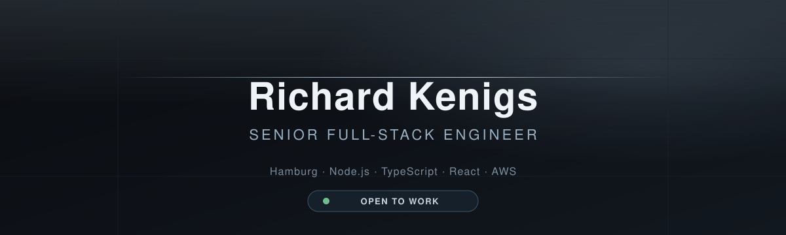

<!--
  GitHub profile README — dark modern editorial
  https://github.com/Rihyx
-->

  

  <a href="https://www.linkedin.com/in/richard-kenigs">LinkedIn</a>
  ·
  <a href="https://jobzillabot.com/">JobzillaBot</a>
  ·
  <a href="https://github.com/Rihyx">@Rihyx</a>

---

### About

Senior full-stack engineer. Ten years building product in fintech, logistics, and Web3.

I work across the stack: TypeScript services, React/Next.js clients, AWS. I care most about systems that stay up and code that other people can change without fear.

What that looks like in practice: platforms at 30k+ daily users, 20+ PSD2 banking integrations, cross-chain bridges that moved millions in assets, serverless products still running in production.

---

### Now

- Building [JobzillaBot](https://jobzillabot.com/). AI job matching over Telegram, backed by AWS.
- Open to senior full-stack and platform roles.

---

### Featured work

| Project | What I shipped |
| --- | --- |
| [JobzillaBot](https://jobzillabot.com/) | Telegram Mini App and serverless AWS pipeline. Gemini matches CVs. Next.js/tRPC dashboard with Tailwind and shadcn. |
| [datahaven-xyz/wayne](https://github.com/datahaven-xyz/wayne) | Decentralized storage at DataHaven. Team lead, roadmap, scaled to 30k DAU. |
| [moonbeam-foundation/xcm-sdk](https://github.com/moonbeam-foundation/xcm-sdk) | Cross-chain / XCM tooling used for Moonbeam bridging and parachain asset transfers. |

---

### Stack

  <strong>Core</strong> 
  
  
  
  
  

  <strong>Backend</strong> 
  
  
  
  
  
  
  

  <strong>Data</strong> 
  
  
  
  
  

  <strong>Frontend</strong> 
  
  
  
  
  
  
  

  <strong>Testing</strong> 
  
  
  

  <strong>Web3</strong> 
  
  
  
  

  <strong>Cloud</strong> 
  
  
  
  
  
  
  

---

<!-- ### GitHub

  

  

--- -->

### Connect

- [linkedin.com/in/richard-kenigs](https://www.linkedin.com/in/richard-kenigs)
- [jobzillabot.com](https://jobzillabot.com/)

  Hamburg · building things that stay up

